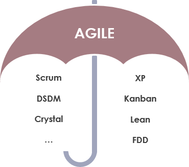

# Agile Methodologies Interview Questions

Q. What is Agile?

Answer

Agile is an approach or mindset in project management and software development. It emphasizes on building software incrementally while adapting and responding to changes as the product and requirements evolve. Agile was introduced as a flexible methodology in response to the rigidness of the traditional waterfall methodology.

---

Q. How does Agile differ from the traditional Waterfall methodology?

Answer

- Agile values adaptability and involvement; Waterfall values planning ahead.
- Agile is an incremental and iterative approach; Waterfall is a linear and sequential approach.
- Agile separates a project into sprints; Waterfall divides a project into phases.
- Agile helps complete many small projects; Waterfall helps complete one single project.
- Agile introduces a product mindset with a focus on customer satisfaction; Waterfall introduces a project mindset with a focus on successful project delivery.
- Requirements are prepared everyday in Agile, while requirements are prepared once at the start in Waterfall.
- Agile allows requirement changes at any time; Waterfall avoids scope changes once the project starts.
- Testing is performed concurrently with development in Agile; testing phase comes only after the build phase in Waterfall.
- Test teams in Agile can take part in requirements change; test teams in Waterfall do not get involved in requirements change
- Agile enables the entire team to manage the project without a dedicated project manager; Waterfall requires a project manager who plays an essential role in every phase.

---

Q. What are some potential drawbacks of using an Agile methodology?

Answer

- Agile is simple to understand in principle but hard to do well in practice. It requires real commitment and first attempts are not likely to go very well.
- The fact that Agile requires minimal planning at the beginning makes it easy to get sidetracked delivering new, unexpected functionality.
- Agile demands more time and energy from everyone because developers and users (e.g. Product Owner) must constantly interact with each other.
- There can be less of a blueprint of what the final deliverable will be. This can make it harder to gain commitment to the project by stakeholders at the early stage.
- Agile can be challenging when there is a supplier-customer relationship. Customers typically want to know what they are getting for their money as early as possible.
- Agile can be very challenging on much larger projects or where co-location is not possible (between developers and the business).
- The agile approach often requires quick shifts from one aspect of a project to another. This may leave little time for doing the proper paperwork at each stage. Record-keeping is important, but it is often a casualty of agile working methods.
- Features that are too big to fit into one or even several cycles might be avoided because they don't fit in nicely into the philosophy.

---

Q. Are Agile and Scrum the same thing?

Answer

No. Agile is a philosophy or mindset and a set of principles. It is an umbrella term used for a number of specific methodologies, one of which is Scrum. While Scrum is the most popular way to implement the agile framework, there are other popular agile methodologies out there such as Kanban and Extreme Programming (XP).

---

Q. What is the role of the scrum master in a scrum team?

Answer

The Scrum Master is accountable for a scrum Team's effectiveness. They focus on coaching the team members in self-management and cross-functionality, eliminating impediments to the team's progress and shielding them from outside interference, and making sure that all scrum events and ceremonies take place and are positive, productive, and kept within the alloted time.

In addition to working with team members, scrum masters also work with project owners as well as stakeholders to ensure that everyone understands and follows scrum practices and is clear about what the team is working on and what the objectives are.

---
