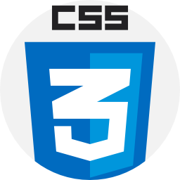
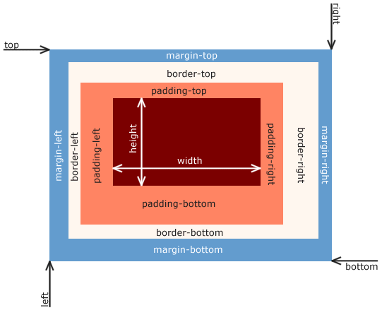
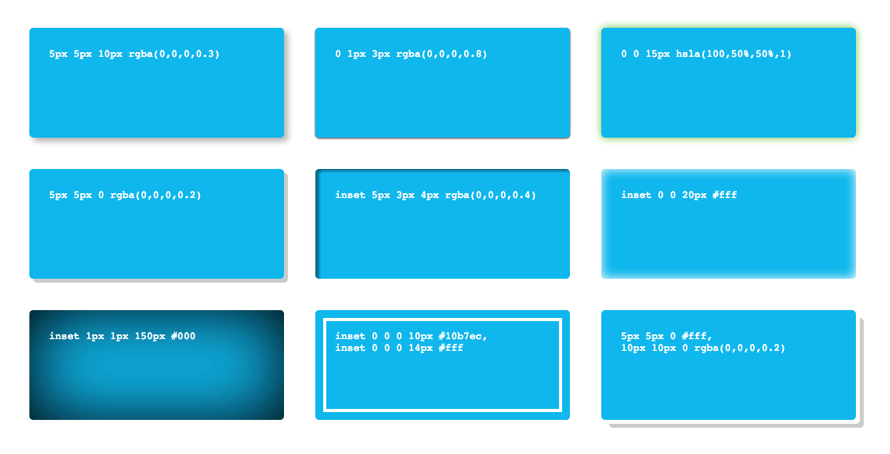

# CSS Interview Questions

Q. CSS stands for Cascading Style Sheets. What is Cascading?

<details><summary>Answer</summary>

Cascading is the process of combining several style sheets and resolving conflicts between them.

The rule used is chosen by cascading down from the more general rules to the specific rule required.

Concepts such as **inheritance** and **specificity** are used to decide which styles get applied.  

For instance,  
- a more specific rule will override a less specific rule.
- a rule defined in an external stylesheet is overruled by a style defined in the `<head>` of the document, which, in turn, is overruled by an inline style within the element itself.

</details>

---

Q. What were some new features that were introduced in CSS3? Which ones are your favorite?

<details><summary>Answer</summary>

- Border radius and border images
- Drop shadows, text shadows, linear and radial gradients
- Animations, Transitions, and 3D Transformations
- Flexbox and Grids
- Web fonts
- Media Queries
- New pseudo-classes (e.g. `:nth-child(n)`, `:nth-of-type(n)`, `:last-child`)

Pick your favorite(s) and be able to explain why.

</details>

---

Q. Are you familiar with any CSS methodologies for writing modular and reusable code?

<details><summary>Answer</summary>

The three most popular CSS methodologies are BEM, SMACSS, and OOCSS. See below for summary of each.

The Block, Element, Modifier methodology (BEM) is a popular naming convention for classes in HTML and CSS. Its goal is to help developers better understand the relationship between the HTML and CSS in a given project. E.g.

```html
<a class="btn btn--big btn--shadow" href="https://www.google.com/">
  <span class="btn__price">$8.99</span>
  <span class="btn__text">Subscribe</span>
</a>
```

```css
/* Block component */
.btn {}

/* Element that depends upon the block */ 
.btn__price {}
.btn__text {}

/* Modifier that changes the style of the block */
.btn--big {}
.btn--shadow {}
```

Scalable and Modular Architecture for CSS (SMACSS) is a style guide that focuses on separating CSS rules into five categories of Base, Layout, Module, State, and Theme. SMACSS is less opinionated about naming conventions than BEM.

‎Object Oriented CSS (OOCSS) is based on two major principles: Separation of structure (height, width, margins, etc.) and skin (colors, fonts, etc.), and Separation of container and content (elements such as images, paragraphs and div tags that are nestled within other elements, which serve as containers).

</details>

---

Q. Describe the CSS Box model.

<details><summary>Answer</summary>

All HTML elements can be considered as boxes. The CSS box model is essentially a box that wraps around every HTML element and consists of margins, borders, padding, and the actual content.



</details>

---

Q. Describe the CSS Box-sizing property

<details><summary>Answer</summary>

The CSS box-sizing property defines whether the width and height of an element should include padding and borders.

**content-box**  
This is the initial and default value as specified by the CSS standard. The width and height properties include the content, but does not include the padding, border, or margin. For example, `.box {width: 350px; border: 10px solid black;}` renders a box that is `370px` wide.

**border-box**  
The width and height properties include the content, padding, and border, but do not include the margin. Note that padding and border will be inside of the box. For example, `.box {width: 350px; border: 10px solid black;}` renders a box that is `350px` wide.

</details>

---

Q. Have you heard of the Block Formatting Context or BFC?

<details><summary>Answer</summary>

A new Block Formatting Context (BFC) is created whenever we use floats, absolutely positioned elements, inline-blocks, table-cells, elements with 'overflow' other than 'visible', etc. Once an element creates a BFC, everything is contained inside it. BFC is used to prevent margins collapsing, text wrapping, or to contain floats.

</details>

---

Q. Are you familiar with CSS Combinators?

<details><summary>Answer</summary>

A CSS combinator explains the relationship between the selectors.

There are four different combinators in CSS:
- The **descendant** selector (`space`) matches all elements that are descendants of a specified element.
- The **child** selector (`>`) matches only those elements matched by the second selector that are the direct children of elements matched by the first.
- The **adjacent sibling** selector (`+`) is used to select something if it is right next to another element at the same level of the hierarchy.
- The **general sibling** selector (`~`) selects siblings of an element even if they are not directly adjacent.

```css
div p {
  background-color: yellow;
}

div > p {
  background-color: yellow;
}

div + p {
  background-color: yellow;
}

div ~ p {
  background-color: yellow;
}
```

</details>

---

Q. What are attribute selectors in CSS?

<details><summary>Answer</summary>

Attribute selectors can be used to style HTML elements that have specific attributes.

```css
a[target="_blank"] {
  /* style rules here */
}

input[type="text"] {
  /* style rules here */
}

[class^="top"] {
  /* style rules here */
}
```
</details>

---

Q. Is it possible to use an image as a border for an element?

<details><summary>Answer</summary>

Yes, we can use the `border-image` CSS property to achieve that. The `border-image` property is a shorthand for five other CSS properties related to border images.

```css
border-image: url(border.png) 30 round;
```

</details>

---

Q. When setting a box shadow in CSS, what is the difference between blur radius and spread radius?

<details><summary>Answer</summary>

```css
box-shadow: (offset-x | offset-y | blur-radius(optional) | spread-radius(optional) | color(optional));
```

`blur radius`: if set to 0 the shadow will be sharp, the higher the number, the more blurred it will be, and the further out the shadow will extend.

`spread radius`: positive values increase the size of the shadow, negative values decrease the size. Default is 0 (the shadow is same size as blur).

</details>

---

Q. What does adding the `inset` keyword to the CSS box-shadow property do?

<details><summary>Answer</summary>

The `inset` keyword changes the shadow from an outer shadow (outset) to an inner shadow.



</details>

---

Q. What are some of the pros and cons of using CSS animations instead of doing them with JavaScript?

<details><summary>Answer</summary>

CSS animations are preferred when we want to create small, self-contained states for UI elements. JavaScript is usually more appropriate when we want to have a greater control over the animations.

While CSS animations tend to be faster than animation performance of jQuery, newer libraries such as GSAP tend to narrow that gap substantially.

CSS keyframe animations are great for sequencing transitions however they only allow for percentages and not time.

</details>

---

Q. What is the difference between block, inline, and inline-block when displaying elements?

<details><summary>Answer</summary>

**Inline**: An inline element does not start on a new line and only takes up as much width as necessary. Some examples of inline elements are `<span>` , `<strong>`, and ``. You can add space to the left and right of an inline element, but you cannot add height to the top or bottom padding or margin of an inline element. Inline elements can appear within block elements.

**Inline-Block**: Compared to `display: inline`, the major difference is that `display: inline-block` allows to set a width and height on the element. Also, the top and bottom margins/paddings are respected. Compared to `display: block`, the major difference is that `display: inline-block` does not add a line-break after the element, so the element can sit next to other elements. One common use for `display: inline-block` is to display list items horizontally instead of vertically.

**Block**: Unlike inline or inline-block elements, a block-level element always starts on a new line and takes up the full width available.

</details>

---

Q. Have you ever played around with blend modes in CSS?

<details><summary>Answer</summary><p>

There are two properties that allow us to blend colors together in CSS: `mix-blend-mode` and `background-blend-mode`. With mix-blend-mode, we define the blending between the element and the elements that are behind it. With background-blend-mode, we define the blending between the element's background image and its background color. Some common blend modes are darken, multiply, overlay, screen and soft-light.

```css
.cover {
    background-image: url(blend-mode-example.jpg);
    background-color: #51B7D3;
    background-blend-mode: luminosity;
}
```


```html
<style>
  .blend1 img:first-child {
    position: absolute;
    mix-blend-mode: soft-light;
  }
</style>

<div class="blend1">
  
  
</div>
```


</p></details>

---
