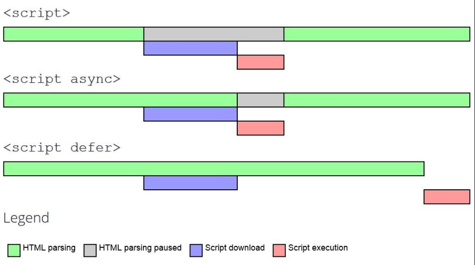
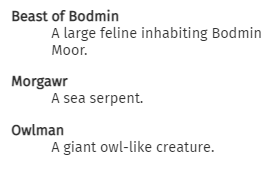
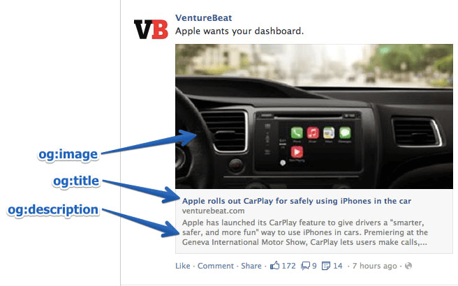

# HTML Interview Questions

Q. Can a webpage contain multiple `<header>` or `<footer>` elements?

<details><summary>Answer</summary>

Yes, it can.

</details>

---

Q. Can a webpage contain multiple `<h1>` elements?

<details><summary>Answer</summary>

Yes, it can. However some SEO experts suggest having only one. Some HTML validation tools will display a warning if multiple `h1` tags are present on a page.

</details>

---

Q. Why do we add a `Doctype` at the beginning of a HTML document?

<details><summary>Answer</summary>

`DOCTYPE` or Document Type Declaration is an instruction to the web browser about what version of HTML the page is written in. Using it ensures that the user agent correctly parses the HTML as we intended it.

HTML5: `<!DOCTYPE html>`

HTML4: `<!DOCTYPE HTML PUBLIC "-//W3C//DTD HTML 4.01 Transitional//EN" "http://www.w3.org/TR/html4/loose.dtd">`

</details>

---

Q. When would you use a datalist element in your HTML?

<details><summary>Answer</summary>

The `<datalist>` element specifies a list of pre-defined options and allows user to add more to it. It conveniently provides an autocomplete feature that allows the user to get the desired options with a type-ahead.

```html
<label for="ice-cream-choice">Choose a flavor:</label>
<input list="ice-cream-flavors" id="ice-cream-choice" name="ice-cream-choice" />
<datalist id="ice-cream-flavors">
    <option value="Chocolate">
    <option value="Coconut">
    <option value="Mint">
    <option value="Strawberry">
    <option value="Vanilla">
</datalist>
```


</details>

---

Q. What is an empty element in HTML?

<details><summary>Answer</summary>

An empty HTML element, has a tag but no children or content. For example `<br>`, `<hr>`, ``, `<input>`, `<link>`, and `<video>` are considered empty elements.

</details>

---

Q. What is the purpose of using defer or async when loading a JavaScript file in your HTML?

<details><summary>Answer</summary>

With `defer` the script is fetched asynchronously, and it's executed only after the HTML parsing is done. Therefore defer does not block the parsing of the page. Scripts marked defer are executed (after parsing completes) in the order which they are defined in the markup.

`<script defer src="script.js"></script>`

With `async` the script is fetched asynchronously, and when it's ready the HTML parsing is paused to execute the script, then it's resumed. Therefore async blocks the parsing of the page. With async, scripts are executed when they are available without any regard for order.

`<script async src="script.js"></script>`



</details>

---

Q. Are you familiar with description lists in HTML?

<details><summary>Answer</summary>

A description list is a list of terms, with a description of each term. The `<dl>` tag defines the description list, the `<dt>` tag defines the term (name), and the `<dd>` tag describes each term. Common uses for description lists are to implement a glossary or to display metadata (a list of key-value pairs).

```html
<dl>
    <dt>Beast of Bodmin</dt>
    <dd>A large feline inhabiting Bodmin Moor.</dd>

    <dt>Morgawr</dt>
    <dd>A sea serpent.</dd>

    <dt>Owlman</dt>
    <dd>A giant owl-like creature.</dd>
</dl>
```



</details>

---

Q. Have you ever used any of the Open Graph meta tags in your HTML code?

<details><summary>Answer</summary>

The Open Graph protocol was first introduced by Facebook but is now used by most social media platforms to control how webpages are displayed when shared. The OG properties are added to to the `<meta>` tags in the `<head>` of the page. For example,

```html
<html prefix="og: https://ogp.me/ns#">
<head>
<title>The Rock (1996)</title>
<meta property="og:title" content="The Rock" />
<meta property="og:type" content="video.movie" />
<meta property="og:url" content="https://www.imdb.com/title/tt0117500/" />
<meta property="og:image" content="https://ia.media-imdb.com/images/rock.jpg" />
...
</head>
...
</html>
```



</details>

---

Q. What is a Canonical URL and how do you set it?

<details><summary>Answer</summary>

If you have a single page accessible by multiple URLs, or different pages with similar content, Google (or other search engines) see these as duplicate versions of the same page. If you don't explicitly tell Google which URL is canonical, Google will make the choice for you. Some benefits of setting a canonical URL explicitly:  
- To specify which URL you want people to see in the search results.
- To simplify tracking metrics for a single product/topic.

```html
<link rel="canonical" href="https://example.com/dresses/green-dresses" />
```

</details>

---
