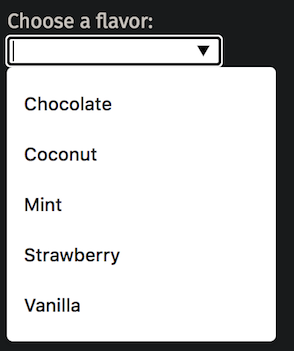

# HTML Interview Questions

Q. Can a webpage contain multiple `<header>` or `<footer>` elements?

<details><summary>Answer</summary>

Yes, it can.

</details>

---

Q. Can a webpage contain multiple `<h1>` elements?

<details><summary>Answer</summary>

Yes, it can. However some SEO experts suggest having only one. Some HTML validation tools will display a warning if multiple `h1` tags are present on a page.

</details>

---

Q. Why do we add a `Doctype` at the beginning of a HTML document?

<details><summary>Answer</summary>

`DOCTYPE` or Document Type Declaration is an instruction to the web browser about what version of HTML the page is written in. Using it ensures that the user agent correctly parses the HTML as we intended it.

HTML5: `<!DOCTYPE html>`

HTML4: `<!DOCTYPE HTML PUBLIC "-//W3C//DTD HTML 4.01 Transitional//EN" "http://www.w3.org/TR/html4/loose.dtd">`

</details>

---

Q. When would you use a datalist element in your HTML?

<details><summary>Answer</summary>

The `<datalist>` element specifies a list of pre-defined options and allows user to add more to it. It conveniently provides an autocomplete feature that allows the user to get the desired options with a type-ahead.

```html
<label for="ice-cream-choice">Choose a flavor:</label>
<input list="ice-cream-flavors" id="ice-cream-choice" name="ice-cream-choice" />
<datalist id="ice-cream-flavors">
    <option value="Chocolate">
    <option value="Coconut">
    <option value="Mint">
    <option value="Strawberry">
    <option value="Vanilla">
</datalist>
```



</details>

---
