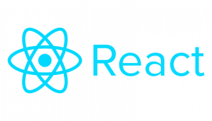
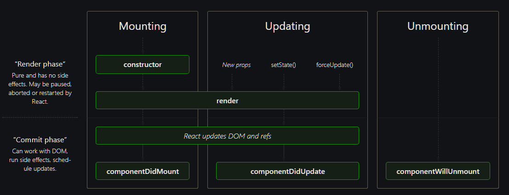

# React Interview Questions

Q. What is the difference between state and props in React?

<details><summary>Answer</summary>

Props are variables passed to a React component by its parent component. State on the other hand is variables directly initialized and managed by the component itself. A component *cannot* change its props, but it can change its state.

</details>

---

Q. What is the main difference between functional components and class components in React? Do you have a preference in using one over the other?

<details><summary>Answer</summary>

A functional component is a plain JavaScript function that returns JSX. A class component is a JavaScript class that extends React.Component and returns JSX inside a render method.

</details>

---

Q. What are the Lifecycle methods?

<details><summary>Answer</summary>

Each component in React has a lifecycle which you can monitor and manipulate during its three main phases. You can think of the phases as the component going through a cycle of birth, growth, and death. The three phases are called Mounting, Updating, and Unmounting.

**Mounting** means creating an instance of a component and inserting it into the DOM. The most commonly used methods associated with this phase are `constructor()`, `render()`, and `componentDidMount()`.

**Updating** takes place whenever a component is updated (i.e. there is a change in its state or prop). The most commonly used methods associated with this phase are `render()` and `componentDidUpdate()`.

**Unmounting** is when a component is being removed from the DOM. The only built-in method associated with this phase is `componentWillUnmount()`.



</details>

---

Q. What is the virtual DOM and how does it differ from shadow DOM?

<details><summary>Answer</summary>

**Virtual DOM**: In React, for every DOM object, there is a corresponding "virtual DOM object." A virtual DOM object is a representation of a DOM object, like a lightweight copy. Manipulating the DOM is slow. Manipulating the virtual DOM is much faster, because nothing gets drawn on screen. Once the virtual DOM has updated, then React compares the virtual DOM with a virtual DOM snapshot that was taken right before the update. By comparing the new virtual DOM with a pre-update version, React figures out exactly which virtual DOM objects have changed. This process is called "*diffing*." Once React knows which virtual DOM objects have changed, then it updates those objects, and only those objects, on the real DOM.

**Shadow DOM**: The shadow DOM is a way of encapsulating the implementation of web components. Using the shadow DOM, you can hide the implementation details of a web component from the regular DOM tree. The isolated scope provided by the shadow DOM results in performance benefits. By isolating the CSS properties for a custom web component, the browser can more accurately determine what needs to be updated when the DOM is manipulated.

**Shadow DOM vs. Virtual DOM**: While the shadow DOM and virtual DOM are similar in their creation of separate DOM instances, they are fundamentally different. The virtual DOM creates an additional DOM. The shadow DOM simply hides implementation details and provides an isolated scope for web components.

</details>

---

Q. What are React hooks?

<details><summary>Answer</summary>

Hooks are functions that let us "hook into" React state and lifecycle features from function components. Hooks don't work inside classes — they let us use React without classes. Before hooks, we could not use state or lifecycle methods in functional components.

</details>

---

Q. When do we use `useEffect()`?

<details><summary>Answer</summary>

Data fetching, DOM manipulation, subscriptions, timers, logging, and other side effects are not allowed inside the main body of a function component. Instead, we can use `useEffect()`.

By default, effects run after every completed render, but you can choose to fire them only when certain values have changed.

</details>

---

Q. How can we prevent React components from re-rendering?

<details><summary>Answer</summary>

There are three common ways to achieve this:

1. By using the `shouldComponentUpdate()` lifecycle method. This method returns true if the component should re-render and false otherwise.
2. By extending the `React.PureComponent` class. This class does a shallow comparison of current props/state with previous props/state. So if the component receives the same props/state as the last render, it won't trigger a re-render.
3. By using `React.memo` if we are working within a functional component. React.memo is equivalent to PureComponent, but it only compares props.

</details>

---

Q. Can you explain Error Boundaries in React?

<details><summary>Answer</summary>

Error boundaries are React components that catch JavaScript errors anywhere in their child component tree, log those errors, and display a fallback UI instead of the component tree that crashed. Error boundaries catch errors during rendering, in lifecycle methods, and in constructors of the whole tree below them.

A class component becomes an error boundary if it defines either (or both) of the lifecycle methods `static getDerivedStateFromError()` or `componentDidCatch()`. Use `static getDerivedStateFromError()` to render a fallback UI after an error has been thrown. Use `componentDidCatch()` to log error information.

Note that error boundaries only catch errors in the components below them in the tree. An error boundary can't catch an error within itself. Only class components can be error boundaries.

</details>

---

Q. What is the best React lifecycle method for making API calls?

<details><summary>Answer</summary>

The `componentDidMount()` method whose job is ensuring that the component is ready.

</details>

---

Q. Are you familiar with the term Prop Drilling?

<details><summary>Answer</summary>

Prop Drilling is the process by which you pass data from one part of the React Component tree to another by going through other parts that do not need the data but only help in passing it around. Essentially you add a prop or event handler in a component way down the hierarchy and you're forced to add it to every parent component as well.

</details>

---

Q. What do we mean by *lifting the state up* in React?

<details><summary>Answer</summary>

Often there will be a need to share state between different components. The common approach to share state between two components is to move the state to common parent of the two components. This approach is called "lifting the state up".

</details>

---

Q. Why can't you update state directly without using the `setState()` method?

<details><summary>Answer</summary>

Mutating the state without using `setState()` can lead to bugs and affect performance. In addition, the component may not be able to detect the change in the state object and therefore not re-render.

</details>

---

Q. When would you use React fragments?

<details><summary>Answer</summary>

A common pattern in React is for a component to return multiple elements. Fragments let you group a list of children without adding extra nodes to the DOM. Fragments are not rendered to the DOM so they can be used where you would normally use a wrapper div and eliminate the need to add extra tags or wrapper div tags.

```js
render() {
  return (
    <React.Fragment>
      <ChildA />
      <ChildB />
      <ChildC />
    </React.Fragment>
  );
}
```

</details>

---

Q. What is code-splitting?

<details><summary>Answer</summary>

TBA

</details>

---

Q. How do controlled and uncontrolled input elements differ from each other?

<details><summary>Answer</summary>

TBA

</details>

---
