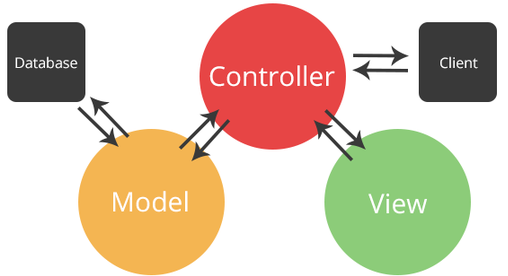
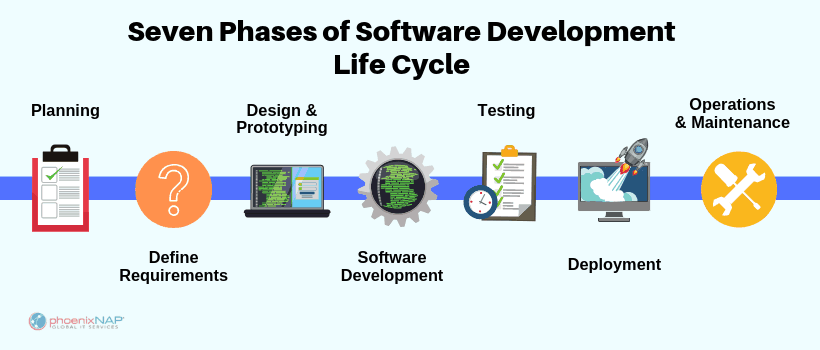
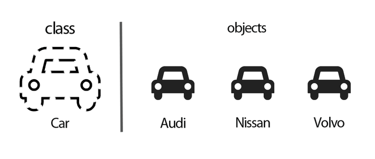

# Web Development Interview Questions

Q. What is an API?

<details><summary>Answer</summary>

An application programming interface (API) is a set of clearly defined methods of communication among various components.

An API simplifies programming by abstracting the underlying implementation and only exposing objects or actions the developer needs.


</details>

---

Q. What is AJAX?

<details><summary>Answer</summary>

Asynchronous JavaScript and XML (AJAX or Ajax) is a set of web development techniques using many web technologies on the client-side to create asynchronous web applications.

With Ajax, web applications can send and retrieve data from a server asynchronously (in the background) without interfering with the display and behavior of the existing page.

</details>

---

Q. Can you describe CORS?

<details><summary>Answer</summary>

Cross-origin resource sharing (CORS) is a mechanism that allows restricted resources on a web page to be requested from another domain outside the domain from which the first resource was served.

CORS relies on a mechanism by which browsers make a "preflight" request to the server hosting the cross-origin resource, in order to check that the server will permit the actual request. In that preflight, the browser sends headers that indicate the HTTP method and headers that will be used in the actual request.

</details>

---

Q. What is a MVC?

<details><summary>Answer</summary>

Model-View-Controller or MVC is a design pattern used to separate user-interface (view), data (model), and application logic (controller). Controller acts as a liaison between the Model and the View, receiving user input and deciding what to do with it.



</details>

---

Q. What is the Software Development Life Cycle (SDLC)?

<details><summary>Answer</summary>

In software engineering, the SDLC is a process for planning, creating, testing, and deploying an information system.



</details>

---

Q. What is Object-oriented programming (OOP)?

<details><summary>Answer</summary>

Object-oriented programming (OOP) is a programming paradigm that relies on the concept of classes and objects. A class is a template (blueprint) for objects, and an object is an instance of a class.



</details>

---

Q. Are you familiar with the four pillars of object-oriented programming?

<details><summary>Answer</summary>

The four principles (pillars) of object-oriented programming are abstraction, encapsulation, inheritance, and polymorphism.

**Abstraction**: hiding the inner workings of a class and just allowing the necessary portions be visible.

**Encapsulation**: a process of binding data members (variables, properties) and member functions (methods) together. In object oriented programming language we achieve encapsulation through Class.

**Inheritance**: the process of creating the new class by extending the the existing class

**Polymorphism**: functions with same name but different arguments, which will perform differently. That is function with same name, functioning in different way. Or, it also allows us to redefine a function to provide its new definition.

</details>

---

Q. Have you heard of the SOLID principles in object-oriented programming?

<details><summary>Answer</summary>

In object-oriented programming, SOLID is a mnemonic acronym for five design principles intended to make software designs more understandable, flexible, and maintainable.

**Single-responsibility principle**: Every module, class or function should only have a single responsibility.

**Open–closed principle**: Software entities (classes, modules, functions, etc.) should be open for extension, but closed for modification; that is, we should be able to add new functionality without touching the existing code for the class. This is because whenever we modify the existing code, we are taking the risk of creating potential bugs. So we should avoid touching the tested and reliable (mostly) production code if possible.

**Liskov substitution principle**: Given that class B is a subclass of class A, we should be able to pass an object of class B to any method that expects an object of class A and the method should not give any weird output in that case. This is the expected behavior, because when we use inheritance we assume that the child class inherits everything that the superclass has. The child class extends the behavior but never narrows it down.

**Interface segregation principle**: The principle states that many client-specific interfaces are better than one general-purpose interface. Clients should not be forced to implement a function they do no need. For example an interface for an ATM which handles all requests such as a deposit request or a withdrawal request, needs to be segregated into individual and more specific interfaces.

**Dependency inversion principle**: It states that our classes should depend upon interfaces or abstract classes instead of concrete classes and functions.

</details>

---

Q. How does Continuous Integration (CI) differ from Continuous Delivery (CD)?

<details><summary>Answer</summary>

**Continuous Integration** is merging all code from all developers to one central branch of the repo many times a day trying to avoid conflicts in the code in the future.

**Continuous Deployment** ensures that every change that is made is ready to be deployed to production.

CI helps development teams avoid "integration hell" where the software works on individual developers' machines, but it fails when all developers combine (or "integrate") their code. Continuous Delivery goes one step further to automate a software release, which typically involves packaging the software for deployment in a production-like environment. The goal of Continuous Delivery is to make sure the software is always ready to go to production, even if the team decides not to do it for business reasons.

</details>

---

Q. What is A/B testing?

<details><summary>Answer</summary>

A/B testing (also known as split testing) is a process of showing two variants of the same web page or app to different segments of visitors or users at the same time and comparing which variant drives more conversions.

</details>

---

Q. What would cause a 403 error in the browser?

<details><summary>Answer</summary>

A 403 Forbidden Error occurs when a web server forbids the user from accessing the page they are trying to open in their browser. Sometimes the user really does not have the right permission to access the resource, other times, there might be an error on the server side of things.

</details>

---

Q. What are some things you can do to improve the performance of your webpage?

<details><summary>Answer</summary>

- Reducing or delaying HTTP calls
- Minifying files
- Loading CSS & JS resources asynchronously
- Making use of a Content Delivery Network (CDN)
- Compressing images
- Making use of browser caching
- Prioritizing above-the-fold content (lazy loading)
- Minimizing redirects as well as 404s

</details>

---

Q. What are some of the things you can do to ensure that your front-end code will work on different browsers?

<details><summary>Answer</summary>

- Use CSS & HTML validation tools
- Use CSS reset or normalize
- Do proper testing across multiple browsers. Tools like BrowserStack can help with that.
- Use various browser extensions that audit code both for compatibility and accessibility.
- Add CSS prefixes for different browsers.
- Use a polyfill JavaScript library that goes through the code and takes care of some of the compatibility issues.

</details>

---

Q. Are you familiar with the factory design pattern?

<details><summary>Answer</summary>

The factory pattern defines an interface for creating an object, but lets subclasses decide which class to instantiate. Factory Method lets a class defer instantiation to subclasses. In other words, it provides an interface for creating objects in a superclass, but allows subclasses to alter the type of objects that will be created.

In Factory pattern, we create objects without exposing the creation logic to the client and refer to newly created objects using a common interface.


</details>

---

Q. Are you familiar with the singleton design pattern?

<details><summary>Answer</summary>

The Singleton Pattern limits the number of instances of a particular object to just one. This single instance is called the singleton.

```js
class UserStore {
  constructor() {
    if (!UserStore.instance) {
      this._data = [];
      UserStore.instance = this;
    }

    return UserStore.instance;
  }
}

const instance = new UserStore();
Object.freeze(instance);

export default instance;
```

</details>

---

Q. Are you familiar with the decorator design pattern?

<details><summary>Answer</summary>

Decorator pattern is a design pattern that allows behavior to be added to an individual object, dynamically, without affecting the behavior of other objects from the same class. This pattern creates a decorator class which wraps the original class and provides additional functionality keeping class methods signature intact.

```js
var User = function(name) {
    this.name = name;
}
 
var DecoratedUser = function(user, street, city) {
    this.user = user;
    this.name = user.name;
    this.street = street;
    this.city = city;
}

var user = new User("Kelly");
var decorated = new DecoratedUser(user, "Broadway", "New York");
```

</details>

---

Q. Are you familiar with the observer design pattern?

<details><summary>Answer</summary>

In the observer design pattern, an object (called Subject)maintains a list of its dependents (observers), and notifies them automatically of any state changes, usually by calling one of their methods.

```js
var Subject = function() {
    this.observers = [];

    return {
    subscribeObserver: function(observer) {
        this.observers.push(observer);
    },
    unsubscribeObserver: function(observer) {
        var index = this.observers.indexOf(observer);
        if(index > -1) {
        this.observers.splice(index, 1);
        }
    },
    notifyObserver: function(observer) {
        var index = this.observers.indexOf(observer);
        if(index > -1) {
        this.observers[index].notify(index);
        }
    },
    notifyAllObservers: function() {
        for(var i = 0; i < this.observers.length; i++){
        this.observers[i].notify(i);
        };
    }
    };
};

var Observer = function() {
    return {
    notify: function(index) {
        console.log("Observer " + index + " is notified!");
    }
    }
}
```

</details>

---
